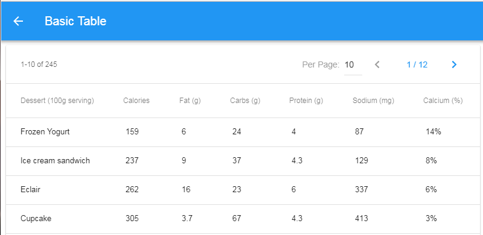
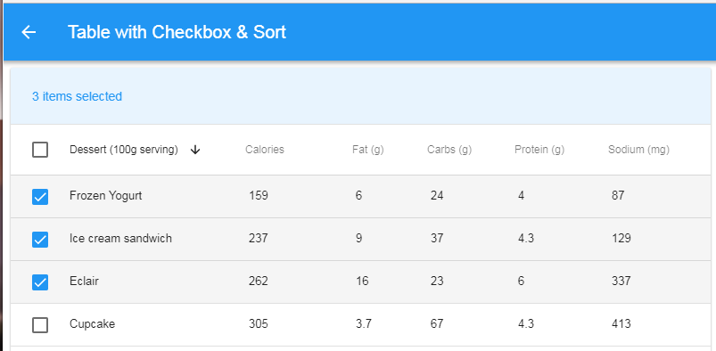
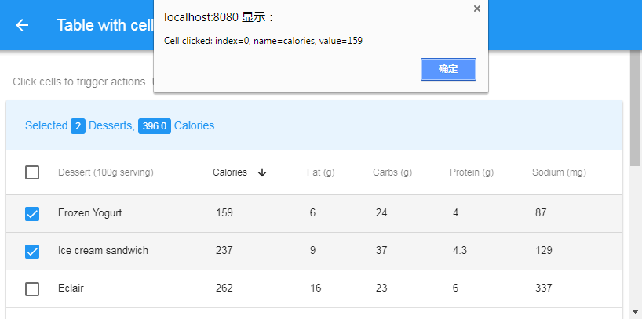

# f7-table Component
component of Framework7 table for Vue.js, including Pagination, Sorting, Selection, customized cell action

Snap-shot:
> 

>

>


Live demo: https://ourbits.herokuapp.com/f7-table

## Features
- One line to create table:
```
<template>
  <f7-table :fields="fields" :querydata="querydata"">
  </f7-table>
</template>  
```
- Pagination
- Sortable
- Selectable
- slot: "data-table-header-selected"
- slot: "tr", "tr_index" for rows

## How to run demo
- git clone https://github.com/kevinqqnj/f7-table.git
- npm install
- npm run dev

That's it!

## Usage
1) setup you framework7 (v2) + vue project.
Here's one kind of template: https://github.com/kevinqqnj/Framework7-Vue-Webpack-Template-v2
2) copy `src/components/f7-table.vue` to your project
3) import it as component in .vue `script`. e.g.
```
<script>
export default {
    components: {
        "f7-table": require('../components/f7-table.vue'),
    },
    ...
```
4) For startup, you only need to specify `:fields` & `:querydata` props for f7-table component in .vue `template`. 
```
# /src/pages/basic-table.vue
<template>
<f7table :fields="fields" :querydata="querydata">
    <!-- slot: data-table-header-selected -->
    <!-- thead -->
    <!-- tbody -->
    <!-- slot: rows -->
</f7table>
</template>
```


## Advanced

### Props:
1) ":fields" format:
```
fields: [
              {
                    name: 'name',	// field name, must Unique
                    title: 'Dessert (100g serving)',
                    titleClass: 'label-cell',
                    dataClass: 'numeric-cell',
                    sortTable: 'Ob',	// sortable or not?
                },
		...
	],
```

2) ":querydata" format:
See: https://github.com/kevinqqnj/f7-table#fetch-data-from-server

3) Show checkbox at first column:
```
# /src/pages/checkbox-table.vue
<f7table :__checkbox="true" />
```

4) use your own `sortOrders` data:
```
<f7table :sortOrders.sync="sortOrders" />
```

5) use your own `per_page` data:
```
<f7table :per_page.sync="per_page" />
```

### Events:
1) @pageChange: listen to page-change event, then fetch new data from server
```
<f7table @pageChange="query_data_from_api()" />
```
2) @orderChange: listen to sort-order-change event, then fetch new data from server
```
<f7table @orderChange="query_data_from_api()" />
```

### Slot
1) slot: "data-table-header-selected"
You can define your own information & actions shown in "data-table-header-selected". e.g.
```
  <div slot="data-table-header-selected" class="data-table-header-selected">
    <div class="data-table-title-selected">
                    Selected <f7-badge color="blue">{{selectedIndexList.length}}</f7-badge> Desserts, 
                    <f7-badge color="blue">{{selected_calories_sum.toFixed(1)}}</f7-badge> Calories
    </div>
  </div>

```

2) slot: "tr", "tr_index" for rows
You can easily define your actions on different cells, e.g. open "Edit" popover, link to other page, etc.
e.g.:
```
# /src/pages/cell-action-table.vue
<f7table :fields="fields" :querydata="querydata" :__checkbox="true" :sortOrders.sync="sortOrders" :per_page.sync="per_page" @orderChange="query_data_from_api()" @pageChange="query_data_from_api()">
    <!-- thead -->
    <!-- tbody -->
    <tr slot="rows" slot-scope="props">
                <td class="checkbox-cell">
                    <label class="checkbox"><input type="checkbox" :value="props.tr_index" v-model="selectedIndexList"><i class="icon-checkbox"></i></label>
                </td>
                <td v-for="f in fields" @click="cell_clicked(props.tr_index, f.name, props.tr[f.name])">
                    {{ props.tr[f.name] }}
                </td>
                <!-- if you need different CSS/Actions for different columns, not use "td v-for", just render "td" one by one-->
    </tr>

</f7table>
```

### fetch data from Server
The table shows data from 'querydata', it can be fetched from server side, format is like:
```
# /src/querydata.js
const querydata = {
  "data": [
          {
            name: 'Frozen Yogurt',
            calories: 159,
            fat: 6.0,
            carbs: 24,
            protein: 4.0,
            sodium: 87,
            calcium: '14%',
            iron: '1%'
          },
 	...
        ], 
  "current_page": 1, 
  "from": 1, 
  "last_page": 12, 
  "per_page": 10, 
  "to": 10, 
  "total": 245
}
```

